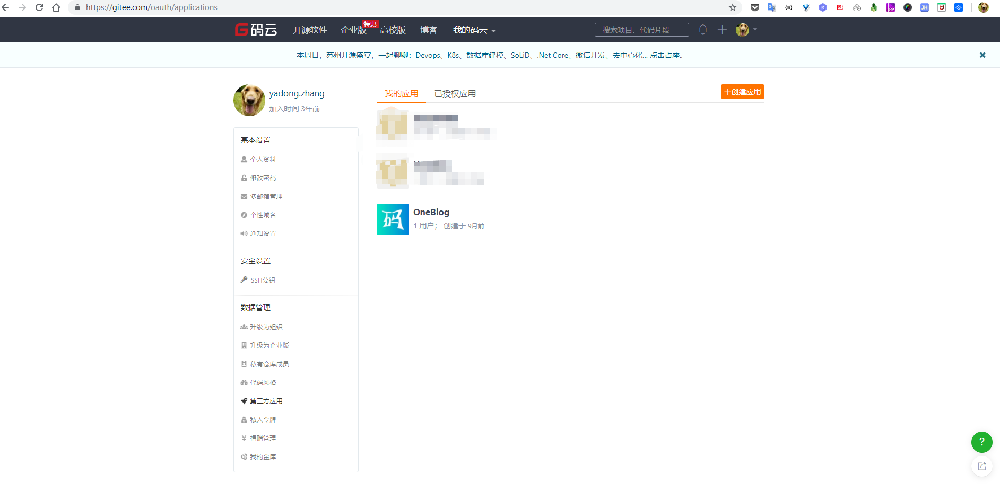
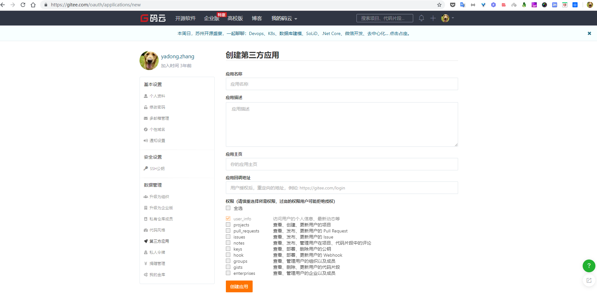
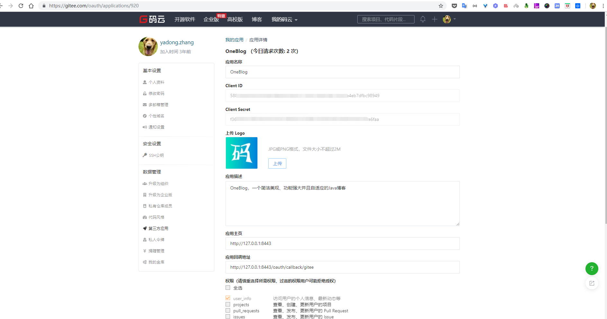
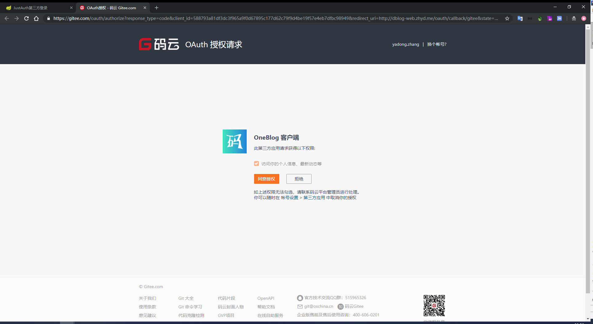

## 1. 申请应用

### 1.1 注册账号

注册Gitee账号：[https://gitee.com](https://gitee.com)。如果已有则忽略该步骤，直接进入第二步。

### 1.2 创建第三方授权应用

进入第三方应用页面（[https://gitee.com/oauth/applications](https://gitee.com/oauth/applications)）



创建应用



- **应用名称** 一般填写自己的网站名称即可
- **应用描述** 一般填写自己的应用描述即可
- **应用主页** 填写自己的网站首页地址
- **应用回调地址** 重点，该地址为用户授权后需要跳转到的自己网站的地址，默认携带一个code参数
- **权限** 根据页面提示操作，默认勾选第一个就行。

以上信息输入完成后，点击确定按钮创建应用。创建完成后，点击进入应用详情页，可以看到应用的密钥等信息



记录以下三个信息：`Client ID`、`Client Secret`和`应用回调地址`，后面我们会用到


## 2. 集成JustAuth

### 2.1 引入依赖

```xml
<dependency>
  <groupId>me.zhyd.oauth</groupId>
  <artifactId>JustAuth</artifactId>
  <version>${latest.version}</version>
</dependency>
```

`${latest.version}`表示当前最新的版本，可以在[这儿](https://github.com/justauth/JustAuth/releases)获取最新的版本信息。

### 2.2 创建Request

```java
AuthRequest authRequest = new AuthGiteeRequest(AuthConfig.builder()
                .clientId("Client ID")
                .clientSecret("Client Secret")
                .redirectUri("应用回调地址")
                .build());
```

### 2.3 生成授权地址

我们可以直接使用以下方式生成第三方平台的授权链接：
```java
String authorizeUrl = authRequest.authorize();
```
这个链接我们可以直接后台重定向跳转，也可以返回到前端后，前端控制跳转。前端控制的好处就是，可以将第三方的授权页嵌入到iframe中，适配网站设计。


### 2.4 以上完整代码如下

```java
import me.zhyd.oauth.config.AuthConfig;
import me.zhyd.oauth.request.AuthGiteeRequest;
import me.zhyd.oauth.request.AuthRequest;
import org.springframework.web.bind.annotation.PathVariable;
import org.springframework.web.bind.annotation.RequestMapping;
import org.springframework.web.bind.annotation.RestController;

import javax.servlet.http.HttpServletResponse;
import java.io.IOException;


@RestController
@RequestMapping("/oauth")
public class RestAuthController {

    @RequestMapping("/render")
    public void renderAuth(HttpServletResponse response) throws IOException {
        AuthRequest authRequest = getAuthRequest();
        response.sendRedirect(authRequest.authorize());
    }

    @RequestMapping("/callback")
    public Object login(String code) {
        AuthRequest authRequest = getAuthRequest();
        return authRequest.login(code);
    }

    private AuthRequest getAuthRequest() {
        return new AuthGiteeRequest(AuthConfig.builder()
                .clientId("Client ID")
                .clientSecret("Client Secret")
                .redirectUri("应用回调地址")
                .build());
    }
}
```
授权链接访问成功后会看到以下页面内容：


点击同意授权即可完成gitee的oauth登录。

## 3. 授权结果

注：数据以脱敏

```json
{
  "code": 2000,
  "msg": null,
  "data": {
    "uuid": "xxx",
    "username": "yadong.zhang",
    "nickname": "yadong.zhang",
    "avatar": "https://avatar.gitee.com/uploads/99/784199_yadong.zhang.png?1462325358",
    "blog": "https://www.zhyd.me",
    "company": null,
    "location": null,
    "email": null,
    "remark": "程序员",
    "gender": "UNKNOWN",
    "source": "GITEE",
    "token": {
      "accessToken": "630740bxxxxxxxx4",
      "expireIn": 86400,
      "refreshToken": "1f2e0faedxxxxx537ec8",
      "uid": null,
      "openId": null,
      "accessCode": null,
      "unionId": null,
      "scope": "user_info",
      "tokenType": "bearer",
      "idToken": null,
      "macAlgorithm": null,
      "macKey": null,
      "code": null
    }
  }
}
```